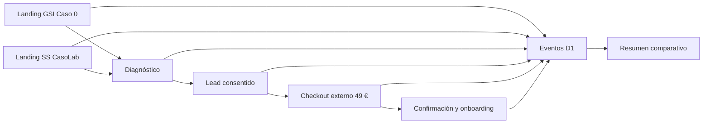

# Implementation Plan: Validación paralela SS CasoLab / GSI Caso 0

> **Estado histórico — supersedido.** Este plan se conserva como contexto y no autoriza trabajo nuevo. El plan vigente es [Academia completa SS CasoLab](../002-ss-casolab-academy/plan.md).

**Branch**: `main` | **Date**: 2026-07-29 | **Spec**: `specs/001-dual-mvp-validation/spec.md`

## Summary

Evolucionar la landing GSI existente hacia una plataforma mínima de dos experimentos. Primero se crea una capa común de atribución y eventos; después se construyen dos diagnósticos autocorregibles, se conectan checkouts externos configurables y se automatizan entrega y medición.

## Technical Context

- **Runtime**: TypeScript, React 19, Next 16 mediante vinext y Cloudflare Workers.
- **Storage**: Cloudflare D1 con migraciones Drizzle.
- **Hosting**: proyecto Sites existente, con coste fijo cero en el alcance actual.
- **Testing**: compilación de producción, pruebas Node, lint y verificación visual.
- **Constraints**: mantener la URL publicada; no incorporar autenticación, pagos propios, clases en directo ni soporte síncrono.

## Constitution Check

No existe una constitución local. Se aplican las reglas globales:

- [x] La especificación es fuente de verdad y es independiente de tecnología.
- [x] El plan mantiene trazabilidad hacia requisitos y criterios de éxito.
- [x] Se definirán pruebas antes de cada incremento de producción.
- [x] Las tareas se agrupan por historia y orden de dependencia.
- [x] Los cambios de alcance se reflejarán en spec, plan y tareas.
- [x] La privacidad se minimiza por diseño.

## Architecture



## Project Structure

```text
app/
  api/leads/
  api/events/
  gsi-caso-0/
  ss-casolab/
db/
  leads.ts
  events.ts
lib/
  experiments.ts
specs/001-dual-mvp-validation/
```

La raíz conservará compatibilidad con la URL GSI publicada y dirigirá al experimento GSI vigente. SS usará una ruta propia dentro del mismo despliegue.

## Data Model

- `leads`: añade experimento y variante; unicidad por email + experimento.
- `funnel_events`: guarda identificador anónimo de sesión, experimento, variante, tipo de evento, ruta, UTM y metadatos acotados.
- Los intentos diagnósticos completos no se persisten en la primera iteración; solo resultados agregados necesarios para el embudo.
- Los pagos viven en el proveedor externo; el sitio registra la confirmación o webhook en una fase posterior.

## Contracts

- `POST /api/leads`: acepta un experimento válido, consentimiento y campos de segmentación; actualiza solo la participación correspondiente.
- `POST /api/events`: acepta eventos permitidos y datos acotados; rechaza experimentos o eventos desconocidos.
- Variables de despliegue posteriores: URL de checkout por experimento y secreto de confirmación si el proveedor lo requiere.

## Delivery Strategy

1. Instrumentación y modelo de datos común.
2. Reposicionamiento y diagnóstico GSI Caso 0.
3. Landing y microcaso SS CasoLab.
4. Preventas reales, legal y confirmación.
5. Automatización de emails y acceso.
6. Lanzamiento, adquisición y revisión semanal.

## Risks

- **Datos incomparables**: se mitiga con precio, eventos y ventana iguales.
- **SS C1 exige precisión especializada**: el microcaso debe pasar revisión experta antes de publicarse.
- **Tráfico insuficiente**: separar métricas de adquisición y conversión.
- **Soporte creciente**: alcance, FAQ y tiempos de respuesta explícitos.
- **Proveedor de pago pendiente**: desacoplar checkout mediante configuración.
